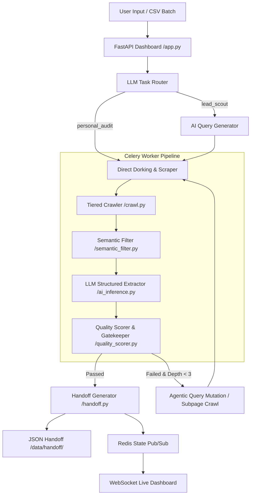

# OMNI INTEL AGENT 🚀

> **Autonomous, India-Focused OSINT & Lead Intelligence Engine**  
> An enterprise-grade, event-driven intelligence agent built for continuous Web Scraping, AI-Driven Target Extraction, OSINT Dorking, and Automated Data Quality Gating.

---

## 📌 Executive Summary

**OMNI Intel Agent** is an end-to-end intelligence system designed to automate OSINT (Open Source Intelligence) research and lead discovery across the Indian ecosystem. It ingests raw natural language prompts or CSV batch targets, automatically determines the correct intelligence pipeline, conducts multi-tier search engine dorking, extracts noise-free semantic text, and uses Groq LLaMA models with strict Pydantic schemas to output verified, structured JSON payloads ready for downstream consumption.

---

## 💡 Key Architectural Features

- 🎯 **Dual-Pipeline Execution Engine:**
  - **`personal_audit` (High Precision):** Tailored for deep investigations on specific named individuals or specific official designations (e.g., *"Secretary Ministry of Civil Aviation"*, *"CEO of HAL"*). Enforces strict target-role matching and rejects unrelated associated executives.
  - **`lead_scout` (Industry & Market Discovery):** Tailored for keyword-based market exploration (e.g., *"Propeller Manufacturers"*, *"Counter Drone Companies"*). Discovers and extracts key personnel across multiple organizations.

- 🇮🇳 **India-First OSINT Context:**
  - Built-in targeting for Indian corporate registries (**ZaubaCorp**, **Tofler**, **Ministry of Corporate Affairs / MCA**).
  - Integrates Indian financial & mainstream news aggregators (**Economic Times**, **LiveMint**, **MoneyControl**, **Business Standard**).
  - Built-in recognition of Indian administrative & corporate designations (**CMD**, **MD**, **DGM**, **Joint Secretary**, **Additional Secretary**, **Director General**).

- 🔍 **Resilient Multi-Engine Dorking:**
  - Parallel query execution across **Google**, **Yahoo**, and **SearXNG**.
  - Dynamic fallback mechanisms handling rate limits (HTTP 429), anti-bot protections, and search string unquoting for long queries.

- ⚙️ **Asynchronous & Non-Blocking Architecture:**
  - Powered by **Celery** task queues and **Redis** (Broker on DB 0, Real-time State DB on DB 1).
  - Non-blocking FastAPI backend utilizing native OS threading to ensure instant UI responsiveness (0.1s prompt submission).
  - Real-time updates delivered to the frontend dashboard via **WebSockets**.

- 🛡️ **Strict Quality Gatekeeping:**
  - Multi-tier filtering rejecting incomplete leads, junk text, boilerplate disclaimers, and generic names.
  - Enforces minimum filled field counts (`MIN_LEAD_FIELDS`) before approving handoff.
  - Controlled mutation logic preventing exponential task fan-out.

---

## 🏗️ System Architecture & Workflow



---

## 🛠️ Tech Stack & Dependencies

| Component | Technology / Library | Purpose |
| :--- | :--- | :--- |
| **Core Language** | Python 3.9+ | Main runtime environment |
| **Web Server** | FastAPI + Uvicorn | High-performance async REST API & WebSocket server |
| **Task Queue** | Celery + Redis | Asynchronous background worker queue & task orchestration |
| **State DB** | Redis | Key-value store & Pub/Sub channel for live job state |
| **LLM Provider** | Groq Cloud API | Ultra-fast LLaMA 3.3 70B & 3.1 8B inference |
| **Data Validation** | Pydantic v2 | Strict JSON schema generation & response validation |
| **Web Scraping** | BeautifulSoup4, Requests, Urllib3 | HTML parsing, DOM extraction, header spoofing |
| **Search Engine OSINT**| `googlesearch-python`, Custom Scrapers | Multi-engine dorking (Google, Yahoo, SearXNG) |

---

## 📁 Repository Structure

```
OMNI INTEL AGENT/
├── config.py                 # Central system configuration & environment variables
├── state_manager.py          # Redis state management & WebSocket Pub/Sub handler
├── dorking_engine.py         # Multi-engine search aggregator (Google, Yahoo, SearXNG)
├── ollama_client.py          # Shared Groq/Ollama LLM client with Pydantic validation
├── celery_worker.py          # Celery app initialization & task registry
├── dashboard/
│   └── app.py                # FastAPI web server, WebSocket handler & HTML Dashboard UI
├── tasks/
│   ├── ai_query_generator.py # Generates targeted OSINT dorking search strings
│   ├── crawl.py              # Multi-tiered scraping logic (Direct, Clean, Dorking)
│   ├── semantic_filter.py    # TF-IDF / pattern-based text noise removal & chunking
│   ├── ai_inference.py       # LLM structured extraction (IntelligenceReport & Lead schemas)
│   ├── quality_scorer.py     # Completeness, relevance & confidence quality gatekeeper
│   └── handoff.py            # Writes verified JSON outputs to data/handoff/
└── data/
    ├── handoff/              # Final output JSON files for downstream consumption
    └── dlq/                  # Dead Letter Queue for rejected/failed jobs
```

---

## 🧩 Deep-Dive Component Breakdown

### 1. Central Configuration (`config.py`)
Defines default system parameters, Groq API keys, model selection (`llama-3.1-8b-instant` / `llama-3.3-70b-versatile`), quality thresholds (`QUALITY_THRESHOLD = 0.5`), semantic filter parameters (`SEMANTIC_FILTER_TOP_K = 5`), and minimum field requirements (`MIN_LEAD_FIELDS = 2`).

### 2. State Manager (`state_manager.py`)
Interacts with Redis Database 1. Provides `set_job_state()`, `get_job()`, and `get_all_jobs()`. Every state mutation publishes a JSON packet over the `job_updates` Redis Pub/Sub channel, which FastAPI broadcasts live to the frontend dashboard.

### 3. Dorking Engine (`dorking_engine.py`)
Concurrently queries search engines using `ThreadPoolExecutor`. Features dynamic query adjustments:
- Automatically appends `"India"` context if missing.
- Applies double quotes (`""`) for short targets (<= 2 words) for precision, while stripping quotes for long queries (> 2 words) to prevent 0-result search blocks.

### 4. Pipeline Router (`dashboard/app.py` & LLM)
Ingests natural language prompts and runs them through the `RouterDecision` Pydantic model. Automatically determines if the target belongs to `personal_audit` or `lead_scout`, extracts the target terms, and dispatches the execution tasks to Celery.

### 5. Multi-Tier Scraper (`tasks/crawl.py`)
- **Tier 1:** Direct domain / URL checking & ETag sitemap validation.
- **Tier 2:** Homepage crawling with DOM cleaning (strips scripts, styles, navigation bars, footers).
- **Tier 3:** Dorking-based link discovery followed by deep subpage crawling (`deep_crawl_top_urls`).

### 6. Semantic Filter (`tasks/semantic_filter.py`)
Scores HTML text blocks using high-value Indian OSINT patterns (`email`, `phone`, `ceo`, `managing director`, `joint secretary`, `vp`, `board`, etc.). Keeps only the top `K` most relevant chunks, removing boilerplate text and cookie notices before sending text to the LLM.

### 7. AI Inference & Extraction (`tasks/ai_inference.py`)
Processes raw text chunks using Groq LLM. Applies strict pipeline-specific rules:
- **For `personal_audit`:** Requires exact designation and name match for the target. Ignores deputies and lower-tier personnel.
- **For `lead_scout`:** Extracts all key leadership and founding team members related to the target industry.

### 8. Quality Scorer & Gatekeeper (`tasks/quality_scorer.py`)
Evaluates extracted leads against a quality scoring matrix:
- Validates completeness, presence of identity, and presence of contact info.
- Rejects generic target names copied as person names.
- Computes `overall_score`. If score >= `QUALITY_THRESHOLD`, the job is marked `COMPLETED` and passed to `deliver_to_omni`. Otherwise, it triggers agentic subpage crawling or query mutation (up to `MAX_AI_LOOP_DEPTH`).

### 9. Handoff Task (`tasks/handoff.py`)
Formats verified lead intelligence into standardized JSON payloads and writes them to disk (`data/handoff/{pipeline}_{job_id}_{timestamp}.json`).

---

## 🚀 Setup & Installation Guide

### Prerequisites
- Python 3.9+
- Redis Server (`redis-server`)
- Groq API Key

### 1. Clone & Environment Setup
```bash
cd "OMNI INTEL AGENT"
python3 -m venv venv
source venv/bin/activate
pip install -r requirements.txt # or install fastapi uvicorn celery redis groq bs4 googlesearch-python pydantic
```

### 2. Configure Environment Variables
Create or edit `.env` / export environment variables:
```bash
export GROQ_API_KEY="your_groq_api_key_here"
export GROQ_MODEL="llama-3.1-8b-instant" # or llama-3.3-70b-versatile
export REDIS_URL="redis://localhost:6379/0"
export STATE_REDIS_URL="redis://localhost:6379/1"
```

### 3. Start Redis Server
```bash
redis-server
```

### 4. Start Celery Worker
```bash
./venv/bin/celery -A celery_worker worker --loglevel=info
```

### 5. Launch Dashboard & API Server
```bash
./venv/bin/uvicorn dashboard.app:app --host 0.0.0.0 --port 8000
```
Open your browser and navigate to **`http://localhost:8000`**.

---

## 📊 Sample Handoff Output (`data/handoff/`)

```json
{
    "job_id": "manual_2913d098",
    "pipeline": "personal_audit",
    "target": "Secretary Ministry of Civil Aviation India",
    "data": {
        "leads": [
            {
                "name": "Shri Samir Kumar Sinha",
                "organization": "Ministry of Civil Aviation India",
                "designation": "Secretary",
                "contact": "secy.moca@nic.in",
                "status": "",
                "source_url": "https://www.civilaviation.gov.in/about-ministry/whos-who"
            }
        ],
        "quality_metrics": {
            "completeness": 1.0,
            "confidence": 0.45,
            "has_identity": true,
            "has_rich_leads": true,
            "rich_lead_count": 1,
            "placeholder_hits": 1,
            "junk_filtered": 0,
            "overall_score": 0.78,
            "ai_reasoning": "The page contains a who's who section with the Secretary of Ministry of Civil Aviation India, along with their contact information."
        },
        "query_strategy": null
    }
}
```

---

## 🛡️ License & Handover

This repository and documentation have been prepared for technical handover and integration with downstream OMNI processing engines. All modules are fully decoupled and communicate via Redis and standardized JSON file handoffs.
